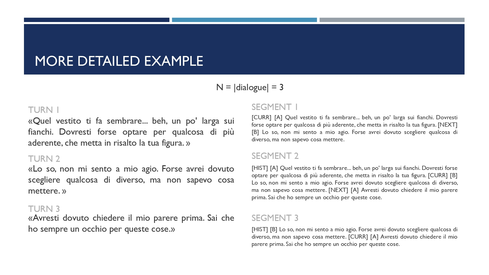
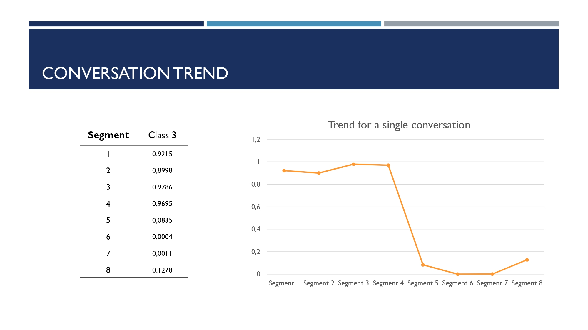

Cyber Intimate Partner Violence
==============================
Cyber Intimate Partner Violence (CIPV) represents a form of psychological abuse that unfolds through digital communication, often leaving no visible trace yet causing significant emotional harm. Detecting such toxicity early is critical for timely intervention and prevention. This study addresses the task of classifying digital partner conversations into ten nuanced categories of toxic relational dynamics. We approach this as a multi-label classification problem and evaluate two methods: a baseline logistic regression model with TF-IDF features, and a fine-tuned version of GilBERTo, a transformer-based Italian language model. While the baseline provides a reasonable foundation, the fine-tuned GilBERTo significantly outperforms it by capturing deep contextual signals within dialogue turns. Moreover, the transformer model supports the identification of the most toxic passage in each conversation, enabling deeper interpretability and insight into the progression of toxic behavior. Despite its strengths, challenges remain in detecting implicit toxicity and handling underrepresented patterns, pointing to future directions in data augmentation and new turns representations.

## Project Organization
```

├── LICENSE
├── README.md                       <- The top-level README for developers using this project.
├── requirements.txt                <- The requirements file for reproducing the analysis environment.
├── setup.py                        <- Makes project pip installable.
├── cipv.ipynb                      <- Main notebook and results. 
├── data
│   ├── processed                   <- The final, canonical data sets for modeling.
│   ├── raw                         <- The original, immutable data dump.
│   └── util                        <- Utility data files, templates.
│ 
└── src                             <- Source code for use in this project.
    ├── __init__.py                 <- Makes src a Python module.
    ├── data                        <- Scripts for data processing.
    │   ├── example_generation.py
    │   ├── toxic_conversations.py
    │   └── __init__.py
    ├── features                    <- Scripts to create features from raw data.
    │   ├── text_inference.py
    │   ├── visualization.py
    │   └── __init__.py
    └── models                      <- Scripts to train and test models.
        ├── baseline.py
        ├── gilBERTo.py
        └── __init__.py
```

## Context-Aware Classification






